# Obys Agency Clone

This is a premium Obys Agency inspired website clone built using HTML, CSS and JavaScript.  
The project focuses on smooth scrolling, immersive animations, interactive UI effects, responsive layouts and modern frontend design aesthetics.

## Features

- Fully responsive layout
- Smooth scrolling experience
- GSAP powered animations
- Interactive custom cursor
- Magnetic navbar hover effects
- Shery.js image distortion effects
- Video interaction section
- Animated marquee section
- Premium typography inspired UI
- Responsive project showcase layout
- Smooth hover and transition animations

## Technologies Used

- HTML5
- CSS3
- JavaScript (ES6)
- GSAP
- ScrollTrigger
- Locomotive Scroll
- Shery.js
- Git & GitHub

## Folder Structure

```bash
obys-agency-clone/
├── index.html
├── style.css
├── script.js
├── README.md
│
├── assets/
│   ├── images/
│   │   ├── Bg-Video.png
│   │   ├── hero-section-desktop.jpg
│   │   ├── about-section-desktop.jpg
│   │   ├── about-section-top-content.jpg
│   │   ├── footer-section.jpg
│   │   ├── image-hover-effect.jpg
│   │   ├── marquee-animation-section.jpg
│   │   ├── mobile-about.jpg
│   │   ├── mobile-hero-section.jpg
│   │   ├── mobile-projects.jpg
│   │   ├── project-grid-1.jpg
│   │   ├── project-grid-2.jpg
│   │   └── video-interaction-section.jpg
│   │
│   ├── videos/
│   │   └── Video.mp4
│   │
│   └── fonts/
│       ├── plain-light-webfont.ttf
│       ├── plain-regular-webfont.ttf
│       ├── silkserif-lightitalic-webfont.ttf
│       └── silkserif-regularitalic-webfont.ttf
```

## Screenshots

### Hero Section

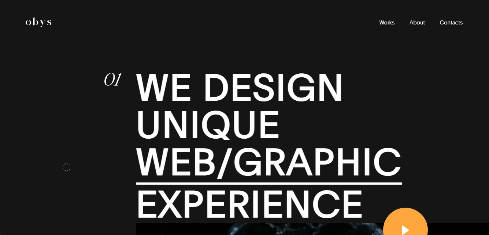

### Video Interaction Section

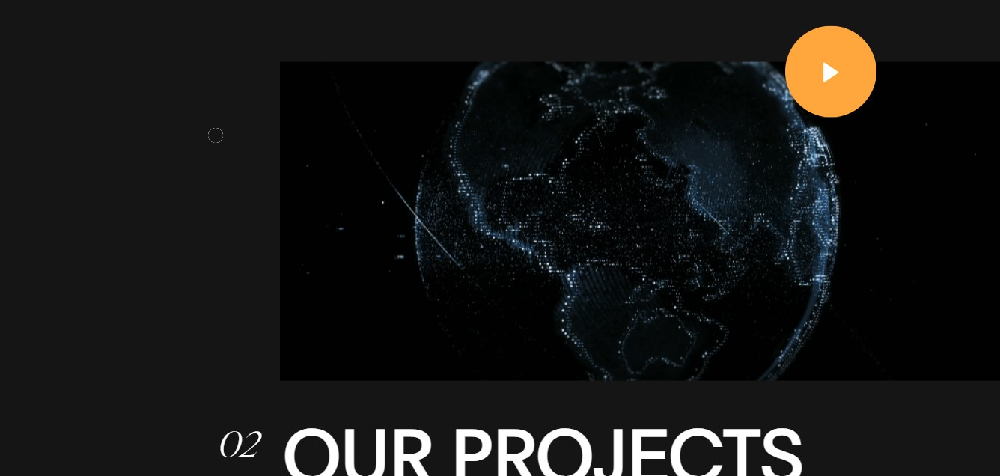

### Projects Grid

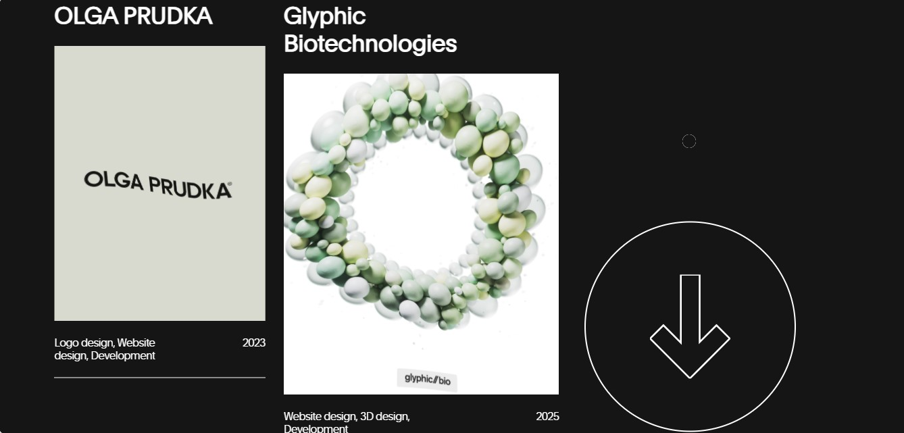

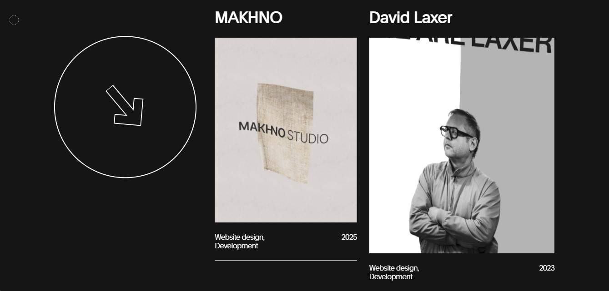

### Image Hover Effect

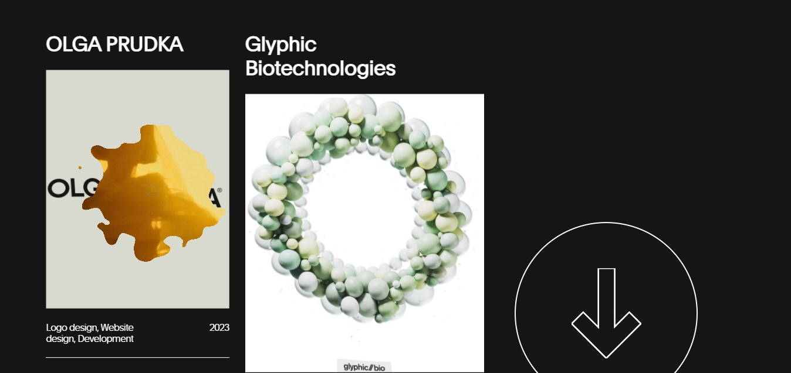

### About Section

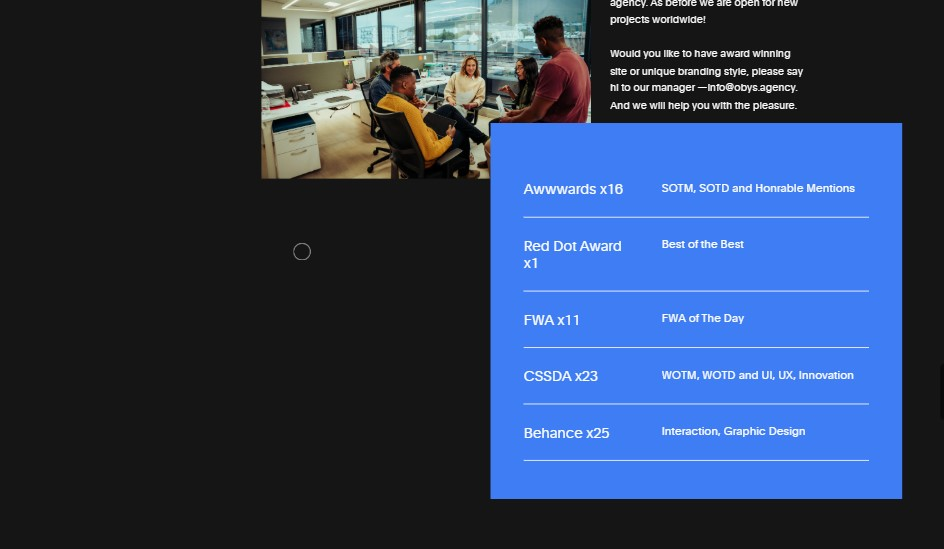

### About Top Content

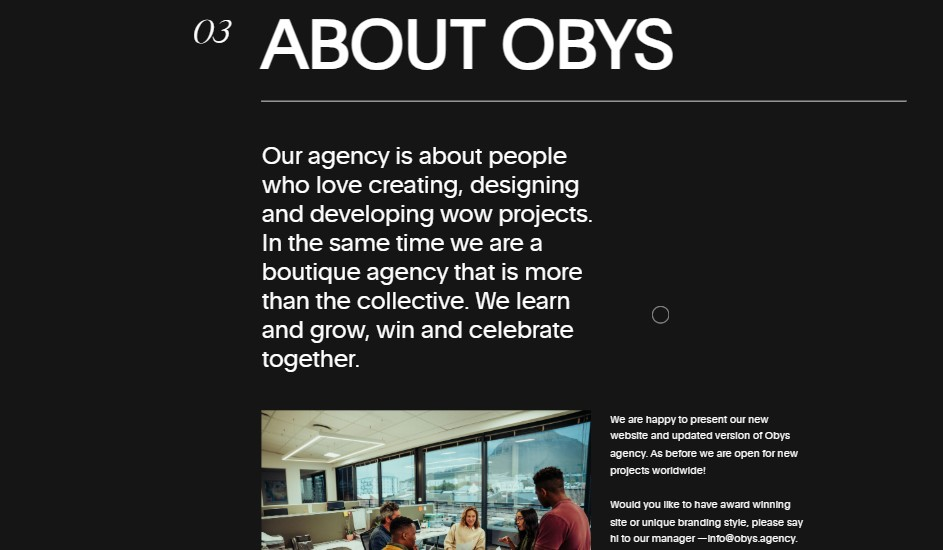

### Marquee Animation Section

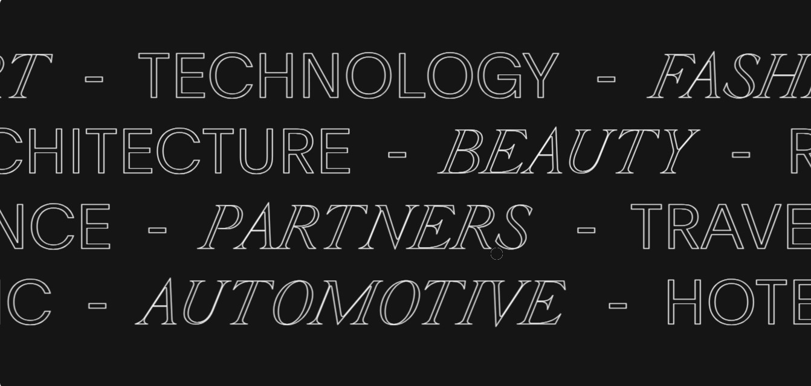

### Footer Section

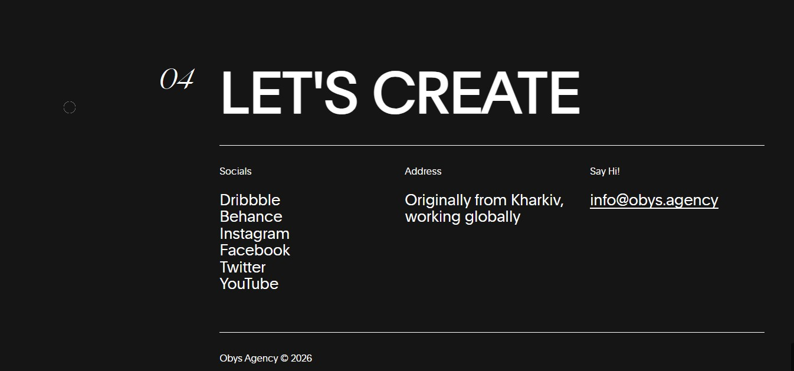

## Mobile Responsive Screenshots

### Mobile Hero

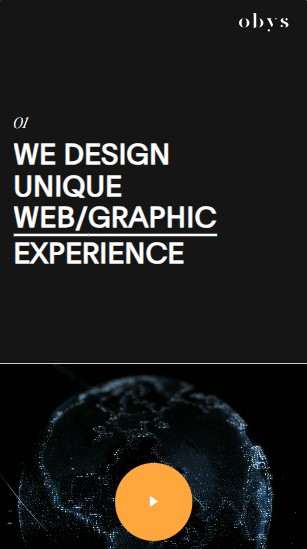

### Mobile Projects

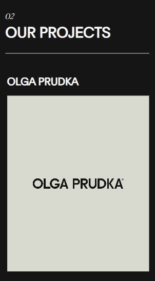

### Mobile About

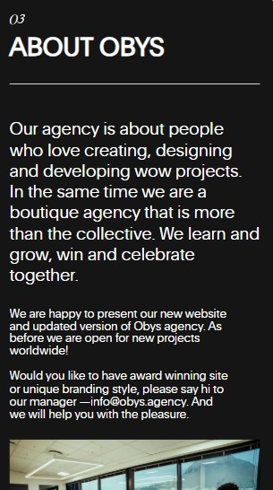

## Demo Video

[Watch Demo Video](https://drive.google.com/file/d/1RuHqs_IKU-aCQTU_5UztMRjT22ZL0eAU/view?usp=drive_link)

## How to Run

### 1. Clone the repository

```bash
git clone https://github.com/kenil948/obys-agency-clone.git
```

### 2. Open the project

Open `index.html` in your browser.

## Live Demo

Check it out here:

https://kenil948.github.io/obys-agency-clone/

## What I Learned

- Advanced GSAP animations
- Smooth scrolling implementation
- Responsive web design
- Interactive cursor effects
- Hover distortion effects using Shery.js
- Scroll based animations
- Typography and layout balancing
- Improving frontend UI/UX
- Better GitHub project structuring

## Notes

This is a frontend practice project created for learning and improving animation-heavy UI/UX development skills.

Inspired by the original Obys Agency website.
